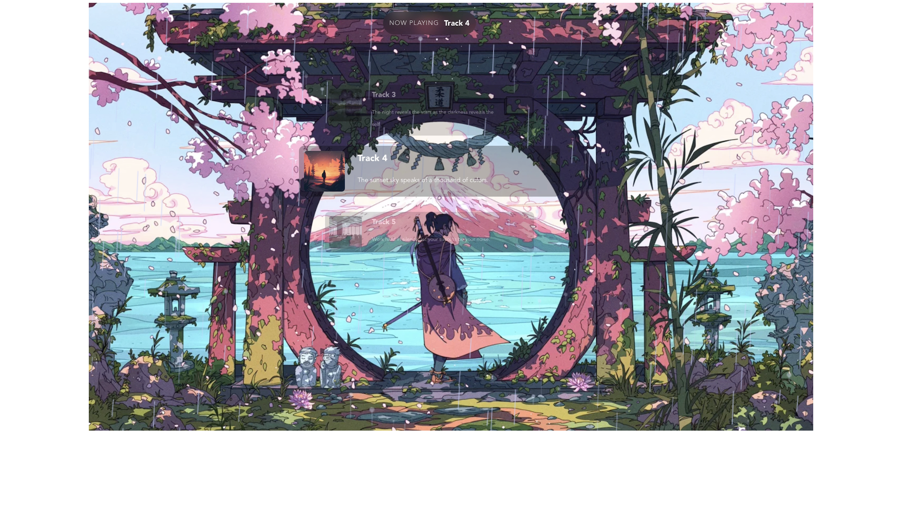

# Lofi Engine Studio

<p align="center">
  
</p>

Lofi Engine Studio is a simple app to create and play lo-fi music.


<p align="center">
  
</p>

## Screen Recording

- Watch: [screenshots/screen-recording.mov](screenshots/screen-recording.mov)

## What It Does

- Generates lo-fi tracks with Tone.js.
- Lets you control ambience and effects.
- Supports keyboard shortcuts.
- Works offline.
- Runs on Linux, macOS, and Windows.

## What Is Added

- New app identity: Lofi Engine Studio.
- ML integration from jacbz-lofi with local server scripts.
- Custom track flow and song mode controls in the UI.
- Video export script for longer lo-fi loops.
- Source attribution and upload steps for your GitHub account.

## What Is Expected Next

- Better onboarding for first-time users.
- Easier model setup with fewer manual steps.
- More ambience presets and sound customization options.
- More testing and stability improvements for release builds.

## Main Features

### Playback

You can play only music, only ambience, or both.

### Immersion Modes

- Music: Focus on beat and chords.
- Atmosphere: Add weather and nature sounds.
- World: Add richer scene sounds.
- Manual: Full control of all sound layers.

### Accessibility

Most actions have keyboard shortcuts.

Press `ESC` to open the info box and shortcut help.

### Languages

The app supports multiple languages, including English, French, Spanish, Japanese, Korean, Indonesian, and Russian.

## Run Locally

### Requirements

- Node.js (v14+)
- pnpm (v6+)
- Rust (latest stable)
- Tauri prerequisites for your OS

### Install

```bash
git clone https://github.com/amnindersingh12/lofi-engine
cd lofi-engine
pnpm install
```

### Development

```bash
pnpm tauri:d
```

### Build

```bash
pnpm tauri:b
```

Build output is created in `src-tauri/target/release`.

## Useful Commands

- `pnpm dev` - Run Vite only.
- `pnpm build` - Build frontend only.
- `pnpm preview` - Preview frontend build.
- `pnpm check` - Run Svelte type checks.
- `pnpm ml:generate:loop` - Continuously generate new jacbz-lofi tracks (default every 240 seconds).
- `pnpm lofi:video -- --visual <clip> --audio <track> --duration <sec> --output <file>` - Generate a longer lo-fi video.

### Paired Visuals + 4-Minute Video Loops

Use the loop generator to automatically assign a matching background image to each generated track. If you also have a matching audio file for each track, the script can export synchronized 4-minute MP4 loops.

```bash
pnpm ml:generate:loop -- \
  --interval 240 \
  --source mixed \
  --export-video \
  --audio-dir ./output/rendered-audio \
  --video-dir ./output/generated-lofi/videos
```

The generator writes a JSON record for each track with the selected visual metadata, then renders an MP4 when the corresponding `track-0001.wav`-style audio file exists in the audio directory.

## Auto-Generate New Lo-Fi Every 4 Minutes

1. Start the ML server:

```bash
pnpm ml:server:dev
```

2. In another terminal, run the loop generator:

```bash
pnpm ml:generate:loop -- --interval 240 --source mixed
```

Tracks are written to `output/generated-lofi/` as JSON files.

Optional:

- Add `--count 15` to stop after 15 tracks.
- Use `--source generate` for pure random latent generation.
- Use `--source predict` for prompt-guided generation only.

## Full Video Export (3 to 5 Minutes)

1. Install FFmpeg:

```bash
brew install ffmpeg
```

2. Run export:

```bash
pnpm lofi:video -- \
  --visual ./input/loop-5s.webm \
  --audio ./input/lofi-track.webm \
  --duration 240 \
  --output ./output/lofi-4min.mp4
```

Notes:

- `--duration` is in seconds.
- Short visuals are looped automatically.
- Short audio is looped automatically.

## Source Attribution

This repo includes an integration of an upstream project:

- Core app baseline and structure are from [meel-hd/lofi-engine](https://github.com/meel-hd/lofi-engine).
- Upstream repository URL: https://github.com/meel-hd/lofi-engine
- `integrations/jacbz-lofi` is based on [jacbz/Lofi](https://github.com/jacbz/Lofi) (Apache-2.0).
- The upstream license is kept in `integrations/jacbz-lofi/LICENSE`.
- Workspace integration notes are in `integrations/jacbz-lofi/WORKSPACE_INTEGRATION.md`.

If you share this repository, keep the attribution and license files.


## Contributing

Contributions are welcome.

- Read [CONTRIBUTING.md](./CONTRIBUTING.md)
- Open issues at: https://github.com/amnindersingh12/lofi-engine/issues

## License

This project uses the [MIT License](LICENSE).
